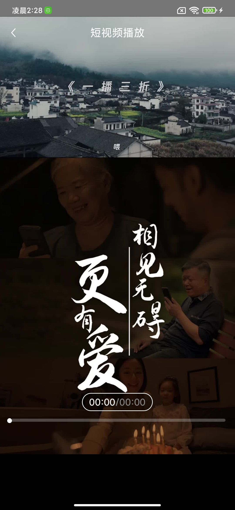
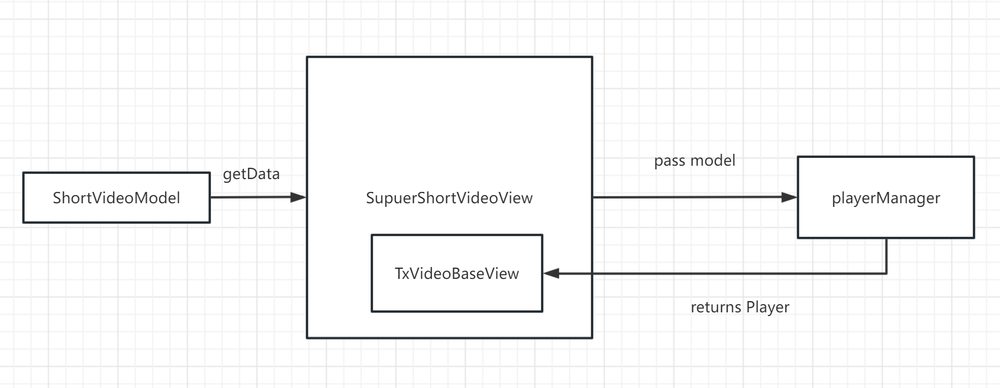

ImitateTikTokPlayer
========
### ImitateTikTokPlayer is a short video player which imitate like TikTok player

#### ImitateTikTokPlayer function

 * video preload 
 * resume and pause function
 * seek function

**Note:** after download the demo, u need to set License throw `TXLiveBase#setLicence`.

**Note:** u can apply the  free license in [tencent cloud 's website](https://cloud.tencent.com/act/event/License)

----------------------------

Code reuse
----------------------------
 * if you want to resue the view of tiktok player , u just need add `SuperShortVideoView` to your view
 * you can add custom view in TikTok listview's item view by the  `TXVideoBaseView#addCustomView `
 * the function of preload next video is implemented by the` PlayerManager` class, `PlayerManager` also have the function of reuse Player.

ImitateTikTok Player's architecture diagram
----------------------------

------------------------------

License
-------
Copyright (C) 2012-2021 tomridder

ImitateTikTokPlayer's source code can be used according to the [Apache License, Version 2.0](LICENSE).
